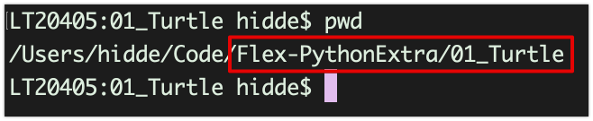

# Committen en pushen naar Github

Als je klaar bent met werken aan je code doe je elke de volgende stappen:

Zorg dat je in de juiste map met je werk voor deze week staat:

*Bijvoorbeeld in week 1 een submap met de naam 01_Turtle*



---

Kijk wat de wijzigingen zijn:
```bash
git status
```

---

Voeg alle bestanden toe die je zometeen wilt gaan *committen*:
 ```bash
 git add -A
 ```

---

Maak een nieuwe versie in *Git* door een *commit* te maken met een duidelijke *commit message*:
```bash
git commit -m "Jouw commit message"
```

---

Het laatst wat je moet doen is alles *pushen* naar Github: 
```bash
git push
```

----

> Kijk nu op Github of alles in je repository staat!
