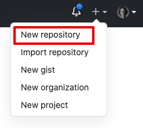
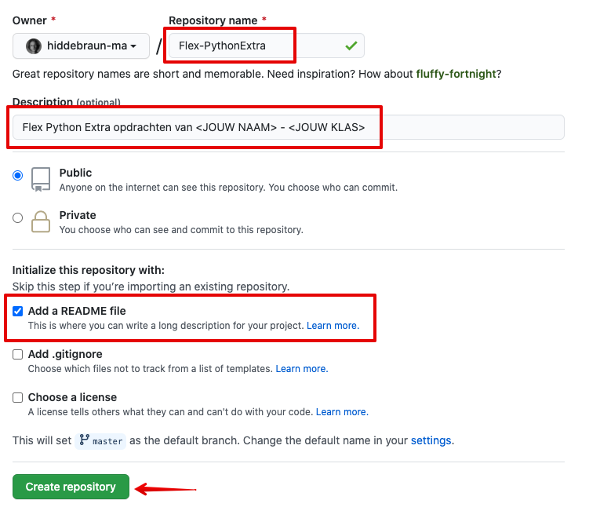
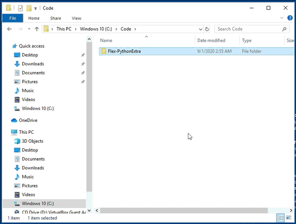
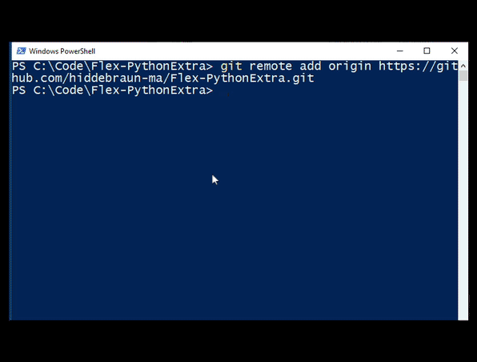
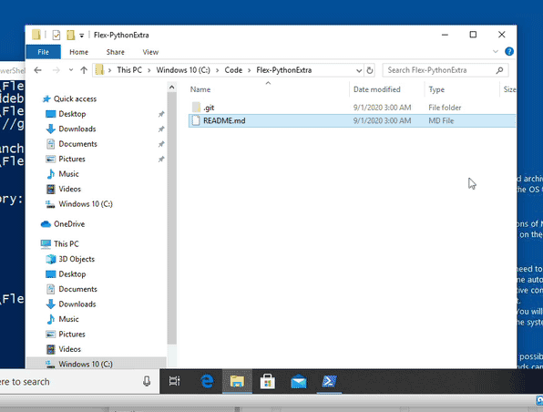
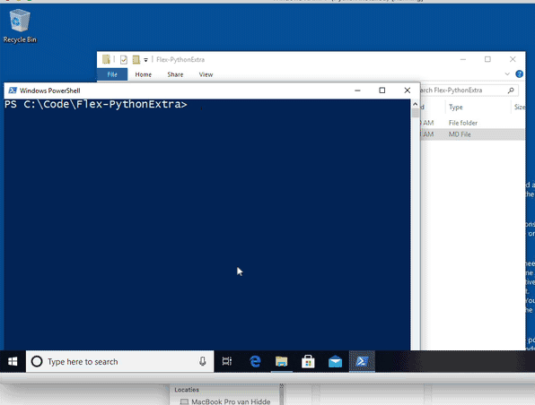

# Map en Github repository maken voor Python Extra

Voor de Python Extra lessen ga je eerst een map en Github repository maken om al je werk in op te slaan.

1. Maak een map **Flex-PythonExtra** aan op een handige plek op jouw computer. *En onthoud die plek!*
2. Maak ook Github repository aan met dezelfde naam: **Flex-PythonExtra**
3. Koppel de map **Flex-PythonExtra** op je computer aan de **Flex-PythonExtra** Github repository 
4. Voor elke Python Extra les maak je hier een nieuwe map aan
5. In die map werk je die week
6. Aan het einde van de les **commit** en **push** je alles naar je Github repository. 

**Hieronder staat hoe je die Github repository aanmaakt en koppelt aan de map. En een voorbeeld hoe je code er in zet, commit en pusht.**

---

## 1. Map maken: Flex-PythonExtra

* Ga naar de plek waar je de map wil en maak daar de map "Flex-PythonExtra"

---

## 2. Nieuwe Github repository maken
Login op Github en klik op "New repository"



Vul de gegevens als volgt in, met jouw naam en klas en **selecteer de optie om een README.me bestand te maken**. Klik dan op "Create repository":



---

## 3. Git repository maken op je computer
Ga naar de map **Flex-PythonExtra** en open daar een Powershell/Command venster (Windows) en als je op een Mac werkt een Terminal venster.

Zorg dat je in de **Flex-PythonExtra** map staat en *initialiseer een nieuwe Git repository* met het volgende commando:

```bash
git init
```



---

## 4. Kopieer de URL van je Github repository
Ga naar je Github repository en kopieer de **HTTPS** url onder de Code knop:


---

## 5. Github repository koppelen aan de Git repository op je computer

Met het commando `git remote add origin <URL>` koppel je je Github repository aan de map op je computer. Bij `<URL>` plak je de url die je in stap 4 hebt gekopieerd.


Je kunt controleren of het gelukt is met het commando: 

```bash
git remote -v
``` 

Dit laat zien welke externe Git repository (Github) aan je lokale repository (op je computer) is gekoppeld.

---

## 6. De laatste wijzigingen van Github halen
Nu de map goed is gekoppeld kun je alle wijzigingen die je nog niet hebt, ophalen van Github. Want (weet je nog) je hebt een README.md bestand gemaakt.

Voer nu dit commando uit:

```bash
git pull origin master
```



Hiermee haal je de `master` branch op naar je computer (de `master` is de standaard branch in Git)

**Als het goed is heb je nu het README.md bestand op je computer staan**

---

## 7. README bestand wijzigen
Je gaat nu een wijziging doen aan het README.md bestand.  
Open het bestand `README.md` in kladblok, of een andere tekst editor en zet jouw naam en klas er in en bewaar het bestand.



---

## 8. De wijzigingen opsturen naar Github
Nu kun je jouw wijzigingen **committen** en **pushen** naar Github. 

1. Eerst kijk je met `git status` wat de wijzigingen zijn. 
2. Dan selecteer je alle wijzigingen met `git add .`
3. Nu commit je alles met een duidelijke commit message: `git commit -m "README gewijzigd"`
4. En dan kun je de master branch naar Github (de origin) pushen  met: `git push -u origin master`



Kijk nu in je Github repository of je commit en wijziging er staat:


---

# Eindelijk... aan de slag

[Aan de slag met Turtle graphics](../01-turtle-graphics/index.md)