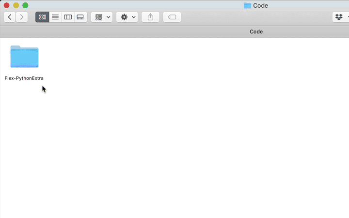
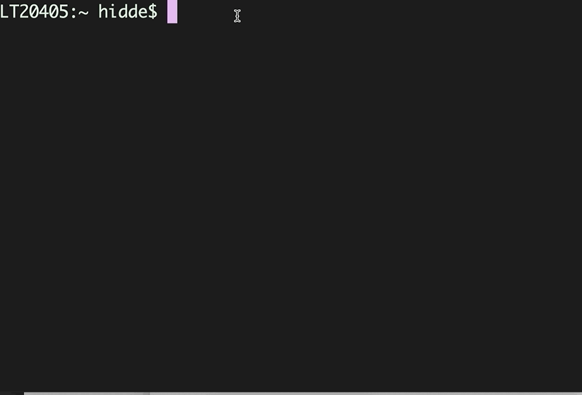

# Terminal venster openen op Mac

Heo open je snel in de juiste map ene Terminal venster op de Mac.

---

### Manier 1
- Klik met rechts op de map en kies voor *"Voorzieningen"* en dan voor *"Nieuw Terminal-venster bij map"*
- Je komt nu direct in de juiste map terecht

Als dat niet werkt probeer manier 2.

---

### Manier 2

Zorg dat je de map waar je heen wilt in beeld hebt en volg deze stappen:

- Open een Terminal venster:
- Typ `cd `  (dus ook een spatie)
- Sleep de map IN het Terminal venster
- Het hele pad naar de map wordt nu achter `cd ` gezet
- Druk op Enter en je komt in de map terecht
  
