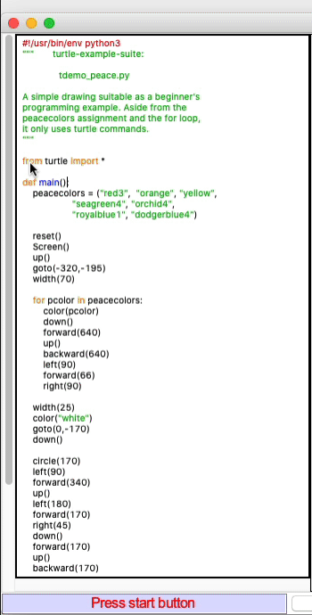

## Opdracht 1 - Peace!

---

Vanaf de command line / terminal kun je een ingebouwde demo van Turtle starten. Er zijn er een aantal.

Probeer eerst onderstaand commando uit te voeren  

```bash
python3 -m turtledemo.peace
```

*Let op, afhankelijk van jouw systeem moet je mischien `python3` vervangen door `python` of `py`*

De volgende stap is om de Python broncode van deze demo te kopieren naar een eigen script. Om ALLE demo's te zien van Turtle voer eerste dit commando uit:

```bash
python3 -m turtledemo
```

1. Kies nu boven in het menu voor **examples** en kies voor **peace**
2. Je krijgt nu aan de linkerkant de broncode en aan de rechterkant de demo te zien
3. Selecteer nu de tekst vanaf ```from turtle import *``` tot aan het einde en kopieer deze code met toetsencombinatie **CTRL + C** (copy) naar je *clipboard* (tijdelijke geheugen)





En ga door naar de volgende opdracht. 

---
[Naar opdracht 2: Your own piece of peace ](turtle_opdracht_02.md)


