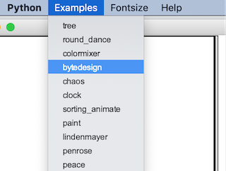

# 01. Turtle DEMO bekijken

---

## Toon de Peace demo

Vanaf de command line / terminal kun je de ingebouwde demo mode van Turtle starten. 

Probeer eerst onderstaand commando uit te voeren: 

```bash
python3 -m turtledemo
```

> Let op, afhankelijk van jouw systeem moet je mischien `python3` vervangen door `python` of `py`, onthoud dit goed!

Als het goed is zie je nu een venster openen. Kies nu bovenin bij het menu voor "examples" en kies één van de demo's. 



Druk dan op de **start knop** om de gekozen demo te starten. Probeer er daarna nog een paar uit.

**Sluit het venster**

---

## Eén van de demo's starten

Je kunt ook alleen één van de demo's starten:

```bash
python3 -m turtledemo.peace
```

Probeer nu een van de andere demo's te starten van de command line. Gebruik de namen uit het *examples* menu in de Turtle demo.

---

## Volgende stap

[Zelf de Turtle besturen](../02-play-with-turtle-cli)
