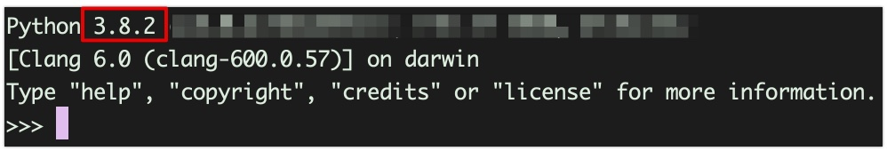
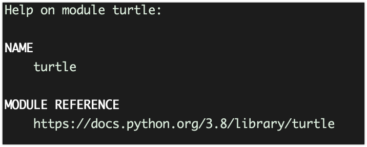
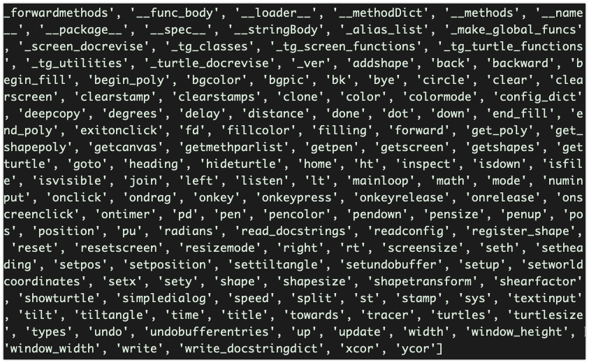
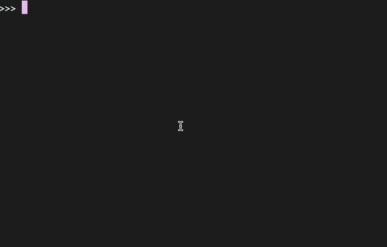
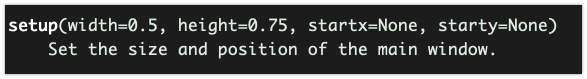
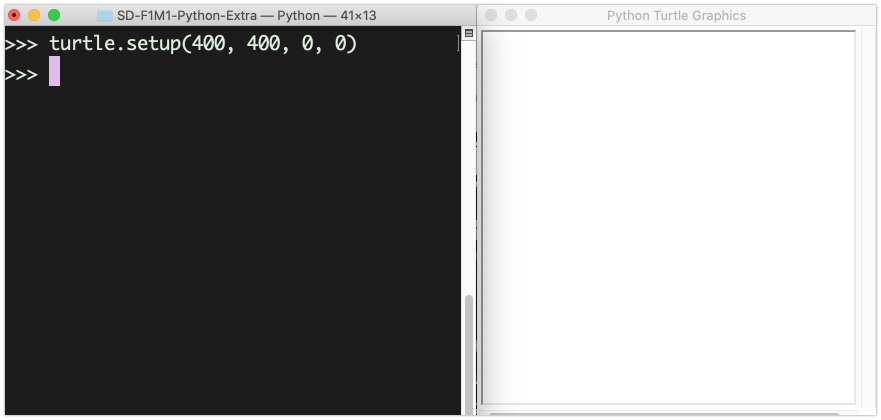

# 02. Zelf de Turtle besturen

Nu je een beetje een idee hebt wat die Turtle allemaal kan, ga je zelf even spelen met de Turtle.

---

## De Python interpreter opstarten

Open een command line / terminal in de map waar je deze week werkt en start de **python interpreter** op.

```bash
python
```

> Let op: Kan dus ook `py` of `python` zijn op jouw computer

Als het goed is zie je zoiets, en begint het versienummer met 3:



Je zit nu in de **Python Interpreter** en hier kun je ALLEEN commando's in de taal **Python** geven.
Dit doe je hier **regel voor regel**.

---

## Importeer de Turtle module
Om met de Turtle te spelen moeten we de *turtle* module eerst in de Python interpreter laden:

```python
import turtle
```

Je hebt nu de Turtle module ingeladen. Maar wat nu?
Om snel te zien wat er in een module zit kun je het commando *help* of **dir(<naam module>)** geven.

---

## Documentatie op het scherm tonen

```python
help(turtle)
````

Dit laat de documentatie van de turtle module zien.
- Met spatie kun je elke keer naar volgend scherm. 
- Met de letter `q` stop je de help weergave en kom je terug in de interpreter

Het leest fijner in een browser, dus je kunt ook naar de link gaan die wordt getoond:
[https://docs.python.org/3.8/library/turtle](https://docs.python.org/3.8/library/turtle){:target="_blank"}




---

## Inspecteren wat er in de module zit

We weten al een stuk meer nu. Maar hoe gaan we die Turtle nou iets laten doen?
Dat doen we door de **turtle** commando's te geven. 

Dat ziet er zo uit:`turtle.<COMMANDO>()`  
Maar op de plaats van `<COMMANDO>` zet je het commando dat je wilt geven.

Om alle **commando's** te bekijken die in de turtle module zitten kun je deze code uitvoeren:

```python
dir(turtle)
```

Wow, dat zijn best wel veel commando's. Let vooral op alle commando's die **NIET** beginnen met  "_"



Kun je al van een aantal commando's bedenken wat er gebeurt als je dat commando aan de turtle geeft?

> Bijvoorbeeld de commando's *forward, backward, pendown, penup?*

---

## Hulp over een commando opvragen
Er zijn een paar om uit te vinden hoe een bepaald commando werkt:
1. De documentatie lezen op [https://docs.python.org/3.8/library/turtle](https://docs.python.org/3.8/library/turtle){:target="_blank"}
2. De ingebouwde `help()` functie gebruiken

We hebben net al de `help()` functie gebruikt om hulp voor de **hele turtle module** te krijgen.
Nu gaan we de `help()` functie gebruiken om informatie over één **turtle** commando te krijgen:

Typ maar eens:

```python
help(turtle.setup)
```

Je krijgt dan de documentatie (uitleg) voor het **setup** commando.  



> Let op: typ de letter **q** (van quit) om de help te sluiten.

Probeer nu zelf of je de `help()` functie kunt gebruiken om informatie over één van de andere commando's te krijgen op je scherm.

---

## Een venster openen om in te tekenen

De ingebouwde `help()` functie van Python geeft handige informatie over HOE een bepaalde commando werkt.   Bijvoorbeeld hoe het **setup** commando** werkt.

We kunnen met het **setup()** commando het venster instellen waarin we gaan tekenen.



We kunnen een **width** (breedte), **height** (hoogte) en **startx** en **starty** op geven.

Laten we een venster maken met een *width* van 400 en *height* 400 en de *startx* en *starty* op 0 instellen:

```python
turtle.setup(400, 400, 0, 0)
```

Als het goed is opent er nu een venster met deze afmetingen en wordt de pen waarmee je gaat tekenen op positie 0,0 gezet.

> Maak je terminal en turtle venster klein genoeg zodat je ze naast elkaar kunt zetten



---

## Turtle laten bewegen
Laat nu de Turtle bewegen door deze commando's uit te proberen.

> Zorg dat je turtle venster in beeld is zodat je kunt zien wat er gebeurt

```python```
turtle.forward(100)
turtle.forward(100)
```

En probeer eens een hoek om te gaan:

```python```
turtle.right(90)
turtle.forward(100)
turtle.right(90)
turtle.forward(100)
```

En weer even alles resetten:

```python
turtle.reset()
```

---

## Zelf uitproberen

Probeer nu zelf deze commando's uit.

Gebruik de *help()* functie om er achter te komen hoe deze commando's werken
*(kies er een paar uit, en oefen er mee, zodat je snel hulp kunt vinden over een commando)*

> Bijvoorbeeld: `help(turtle.forward)` of `help(turtle.home)`

|------------|-----------------|
| forward(aantal)  | Zet *aantal* stappen vooruit |
| backward(aantal) | Zet *aantal* stappen terug |
| right(graden)    | Draai aantal *graden* rechtsom |
| left(graden)     | Draai aantal *graden* linksom |
| pos()            | Vraag de positie op |
| goto(x, y)       | Ga naar positie *x,y* |
| setx(x)          | Zet de *x* positie |
| sety(y)          | Zet de *y* positie |
| home()           | Terug naar start | 
| circle(straal)   | Tekent cirkel met opgegeven *straal* |
| dot(grootte)     | Teken een punt met een *grootte* |
| penup()          | Pen op het "papier" |
| pendown()        | Pen van het "papier" af |
| width(dikte)     | Lijndikte zetten naar *dikte* |
| shape(s)         | Zet de vorm naar s. "turtle", "arrow" ,"circle" |

Je kunt ook [online hulp](https://docs.python.org/3/library/turtle.html#turtle-methods){:target="_blank"} vinden ;-)

> **TIP:** Leer jezelf aan om documentatie en hulp te lezen **voordat** je gaat programmeren. 
> Dan weet je al een beetje **hoe** een commando werkt en hoe je het gebruikt.

---

## Probeer nu zelf de volgende uitdagingen

- Teken een vierkant
- Teken een rechthoek
- Teken een driehoek
- Teken een cirkel
- Teken een ster
- Teken 3 vierkanten

> Maak een schermfoto van wat je hebt gemaakt en sla deze op in de map van deze week

---

## Volgende stap
[Kleuren en vormen](../03-colors)