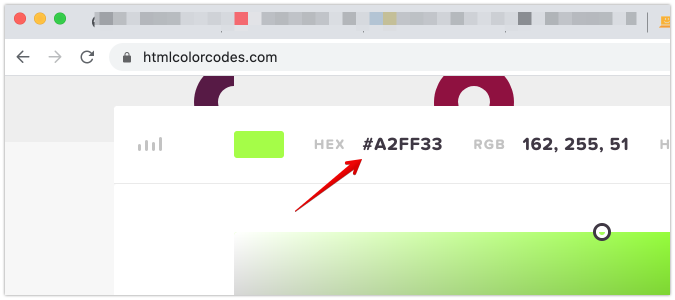
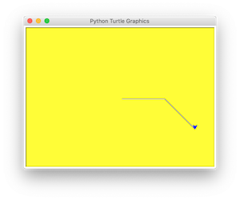

# 03. Kleuren en vormen

Misschien had je al het `color()` commando gezien. Dat commando gebruik je om de kleur in te stellen waarmee je tekent.
Reset eerste de turtle eventjes:

```python
turtle.reset()
```

## Tekenkleur instellen
Zet nu de kleur naar blauw en teken wat lijnen. De Turtle snapt alleen Engels dus zeggen we "blue".
En probeer een paar andere Engelse kleurnamen uit.

```python
turtle.color("blue")
turtle.forward(100)
turtle.right(45)
turtle.forward(100)
turtle.right(45)
```

Je kunt in plaats van de kleurnaam ook een hexadecimale code gebruiken als je een hele specifieke kleur wilt.
Kies [hier een mooi kleurtje uit](https://htmlcolorcodes.com/){:target="_blank"} en stel hem in.



`turtle.color("#A2FF33")`

---

## Achtergrondkleur instellen

Ook de achtergrond kun je een kleur geven. Maar dat commando geef je niet aan de turtle maar aan het venster.
Je haalt eerst het scherm op met `turtle.getscreen()` en geeft het een naam, in dit geval `venster`.

```python
venster = turtle.getscreen()
venster.bgcolor("yellow")
```



---

## Volgende stap
[Werken met een Python script met commando's](../04-python-file/)