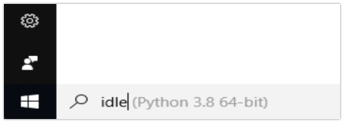
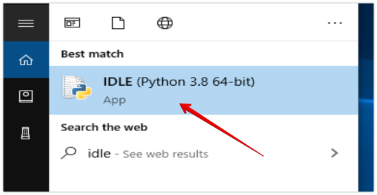
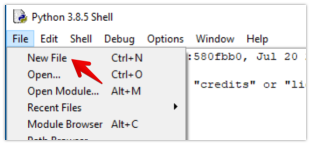
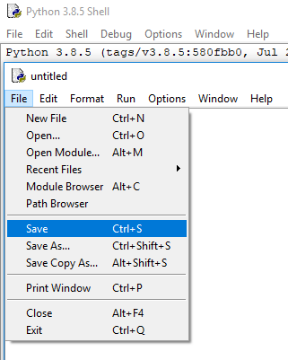
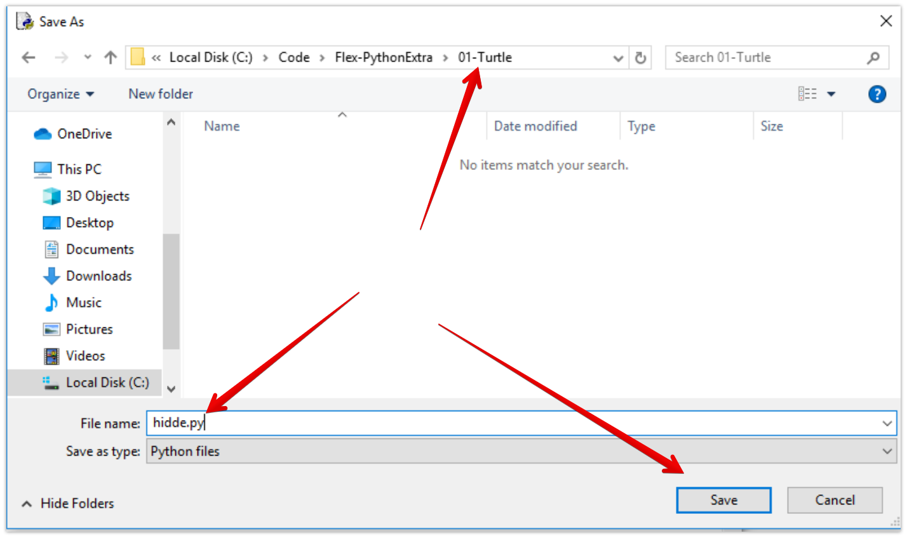

Tot nu toe heb je in de Python Interpreter gewerkt.  
Elke regel werd direct uitgevoerd nadat je op ENTER drukte.
Nu gaan we een **apart Python bestand** maken die we gaan uitvoeren.

## Open de Python IDLE editor
Zoek op je computer naar IDLE, dit is de al geinstalleerde Python editor.

### Windows
In **Windows** vind je deze door in de zoekbalk te zoeken naar IDLE. 

---

### Mac
Op een **Mac** vind je IDLE bij *Programma's/Apps > Python 3.x -> IDLE*:

---

## Maak een nieuw Python script
Als je IDLE opstart zie je weer de Python Interpreter waar je net al in hebt gewerkt. Deze kun je nog steeds gebruiken om dingen in uit te proberen.

Je gaat nu een los bestand maken waar je Python code in gaat zetten:

Kies bovenin voor *File > New file*:

Bewaar het bestand:

Ga naar de map waar je in werkt deze week (submap van je **Flex-PythonExtra** map)  en sla het bestand op als: *&lt;jouwvoornaam&gt;.py* 

> Gebruik in plaats van &lt;jouwnaam&gt; natuurlijk je echte voornaam, en gebruik alleen kleine letters!

---

## Volgende stap
[Loops gebruiken](../05-loop-it/){:class="next"}
