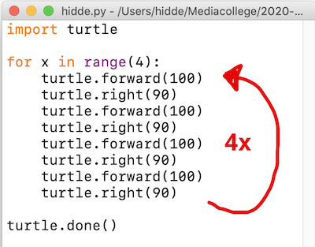

# Loops gebruiken 

Je kent nu de basis commando's om de Turtle **regel voor regel** te laten bewegen en tekenen.

Nu gaan we in het nieuwe Python bestand wat je open hebt wat meer code schrijven.

Je weet inmiddels dat dit de code is om een vierkant te maken:

```python
turtle.forward(100)
turtle.right(90)
turtle.forward(100)
turtle.right(90)
turtle.forward(100)
turtle.right(90) 
turtle.forward(100)
turtle.right(90)
```

Wil je deze code 4x herhalen omdat je 4 vierkanten wilt tekenen, dan kun je een **loop** (spreek uit: loep) schrijven. 

> Een *loop* herhaalt de code binnen de loop het aantal keer dat jij instelt

---

## Voorbeeldcode kopiëren en opslaan
Kopieer deze code in je Python file en bewaar het bestand (File > Save)

```python
import turtle

for x in range(4):
    turtle.forward(100)
    turtle.right(90)
    turtle.forward(100)
    turtle.right(90)
    turtle.forward(100)
    turtle.right(90)
    turtle.forward(100)
    turtle.right(90)
    
turtle.done()
```

---

## De code uitvoeren
Om het bestand uit te voeren voer je het bestand uit via de terminal.

> We hebben de code om een vierkant te maken dus in een loop gezet en het wordt nu 4x achter elkaar uitgevoerd.

Deze regel zorgt dat er code 4x wordt uitvoert:  
`for x in range(4):`

* Alleen de code er onder staat en inspringt met **een tab** hoort bij de loop!
* Python weet omdat de code inspringt **dat alleen deze code** herhaalt moet worden.
* Na de 4e keer is Python klaar met de loop en gaat verder met `turtle.done()`



> `turtle.done()` zorgt ervoor dat het venster open blijft na de laatste instructie en niet wordt gesloten. Probeer maar eens zonder die regel!

---

## Het Python bestand uitvoeren vanaf de command line
Je kunt dit bestand ook vanaf de command line uitvoeren. Weet je nog hoe je een terminal venster opent in een map?

Open een terminal venster in de map waar je script staat en voer het script uit met Python:

```python
python3 myTurtle.py
```

> Uiteraard gebruik je de juiste bestandsnaam van jouw Python bestand!

## Uitdaging
- Haal de laatste `turtle.right(90)` weg, voer het script uit. Wat gebeurt er nu en waarom ?
- Zet de regel weer terug
- Verander de laatste `turtle.right(90)` in `turtle.right(45)`
- Verander de laatste `turtle.right(90)` in `turtle.left(45)`

> Je snapt het al, probeer zelf wat mooi patronen te maken met een loop en lijnen, cirkels, vierkanten, enzovoorts.

**Maak schermafbeeldingen van je werk of sla je Python bestanden allemaal los op in de map**


## Probeercode

Je snapt het al, als je een beetje snapt hoe het werkt kun je leuke dingen maken:

```python
import turtle

turtle.speed(0)
turtle.bgcolor("black")
turtle.pencolor("red")
turtle.fillcolor("white")
turtle.begin_fill()

for x in range(36):
    turtle.forward(100)
    turtle.right(90)
    turtle.forward(200)
    turtle.right(90)
    turtle.forward(100)
    turtle.right(90)
    turtle.forward(200)
    turtle.left(5)

turtle.end_fill()
turtle.done()
```

Of wat dacht je van deze (schaamteloos van internet geplukt)

```python
import turtle             
colors = [ "red","purple","blue","green","orange","yellow"]
turtle.speed(0)
my_pen = turtle.Pen()
turtle.bgcolor("black")
for x in range(360):
   my_pen.pencolor(colors[x % 6])
   my_pen.width(x/100 + 1)
   my_pen.forward(x)
   my_pen.left(59)
   
turtle.done()
```

---

## Maak nu zelf een paar mooie kunstwerken
Kijk of je zelf een paar mooie kunstwerken kunt maken door wat regels in de code hierboven aan te passen of door zelf dingen uit te proberen, **wees niet bang, er kan niets kapot ;-)**

Hier vind je ook veel leuke voorbeelden om uit te proberen:  

* [https://www.geeksforgeeks.org/turtle-programming-python/](https://www.geeksforgeeks.org/turtle-programming-python/){:target="_blank"}
* [https://www.tutorialspoint.com/turtle-programming-in-python](https://www.tutorialspoint.com/turtle-programming-in-python){:target="_blank"}

Of Google naar: *python turtle example code*

> Maakt niet uit als je niet alle code snapt, je gaat de komende weken veel van de code leren lezen, schrijven en begrijpen.

----

## Je werk op Github zetten

[Je werk *committen* en *pushen* naar Github](../../00-setup/commit_push.html){:class="next"}

---

> Vraag om hulp tijdens de Flex Python Extra lessen als je vastloopt!
