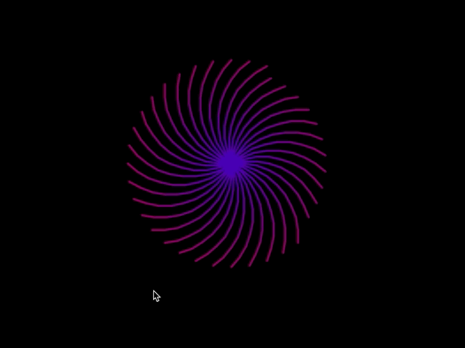

# 01 - Spelen met Turtle

In het begin is programmeren lastig. Je moet eerste leren hoe je de Python taal spreekt, en dat is best even lastig omdat je nog niet zoveel ingewikkelde dingen kunt maken. Daarom is het leuk om alvast wat voorbeelden en code te krijgen waar je iets werkends mee kunt maken en om meer gevoel te krijgen bij het programmeren in de Python programmeertaal. 

Dit gaan we doen door te spelen met *"Turtle"*. Turtle is een ingebouwde *module* van Python. Deze krijg je als je Python installeert.

---

Met Turtle kun je door het schrijven van code, tekenen op een leeg scherm. Jij als developer bestuurt een schildpad (de Turtle!) die je laat bewegen en tekenen precies zoals jok dat als developer programmeert!

Je zult zien dat door gebruik te maken van een aantal stukjes handige Python code, je een prachtige tekening of animatie kunt maken.

Het doel is dan ook om aan het einde van de les een mooi kunstwerk of animatie (of beide) te maken en de mogelijkheden van Turtle te onderzoeken 

### Leerdoelen van deze les
* Ik kan de Turtle demo vanaf de command-line / terminal tonen
* Ik kan de Turtle module inladen in een eigen Python script en een nieuwe Turtle maken
* Ik kan het uitleggen hoe het coordinaten systeem van de Turtle werkt
* Ik kan de Turtle aansturen en naar een specifieke plek laten bewegen op het scherm
* Ik kan de Turtle vooruit, achteruit, naar links en rechts laten bewegen met code op een bepalde snelheid.
* Ik kan een lijn, driehoek, vierkant, vijfhoek en andere simpele figuren tekenen met Python code
* Ik kan *for .. in range()* loop (spreek uit: "loep") gebruiken om een tekeninstructie meerdere keren uit te voeren.

---

## Aan de slag!
[Toon de Turtle demo](01-start-demo/index.md)

