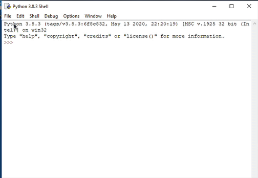
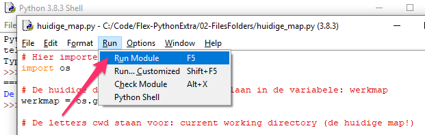
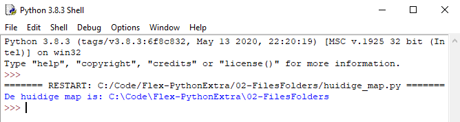

> Maak dus alle Python bestanden in de map die je net hebt aangemaakt!

## Maak een nieuw bestand
* Open de IDLE editor en maak een nieuw Python bestand via *File > New file*
* Sla het bestand op in de werkmap **02-FilesFolders** met de naam: `huidige_map.py`



---

We gaan werken met de `os` module die in Python zit.  

> Een regel in Python code die begint met een `#` is een commentaar regel. Commentaar regels of "comments" gebruik je om je code uit te leggen en te verduidelijken. Deze regels worden door de Python interpreter **niet uitgevoerd**.

```python
# Hier importeer je de os module
import os

# De huidige directory opvragen en opslaan in de variabele: werkmap
werkmap = os.getcwd()

# De letters cwd staan voor: current working directory (de huidige map!)

# Op het scherm printen
print("De huidige map is: " + werkmap)
``` 

Voer het script uit met F5 (of Run > Module) 



Als het goed is krijg je zoiets als *output*:



Wat staat er bij jou? 

> Maak een schermafdruk als bewijs en zet het plaatje bij het script.

Weet je nog hoe je het script vanaf de command line kunt uitvoeren? Probeer dat nu (om te oefenen)

---

> Wat je ziet is een **absoluut path** (pad). Een absoluut path toont altijd het **volledige path** op je computer naar een bestand of map.

> Een **relatief path** is juist afhankelijk van de huidige *working directory* (werkmap)


---

## Volgende stap
[Mappen maken](../02-folders/){:class="next"}
