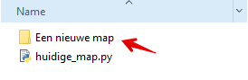
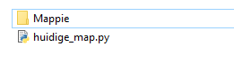
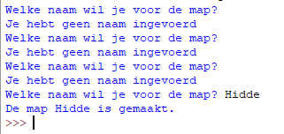

Je gaat nu een nieuwe map aanmaken met Python. 
Voeg deze code toe aan je script en voer het script uit (F5):

```python
# Een nieuwe map maken met os.mkdir()
os.mkdir("Een nieuwe map")
```

> In de folder waar je script staat is nu een nieuwe map gemaakt.



> Probeer nu zelf nog een paar mappen aan te maken met de `os.mkdir()` functie.

Verwijder daarna de mappen weer.

---

## De gebruiker vragen om de naam voor de map
- Je kunt de `input()` functie gebruiken om een naam te vragen aan de gebruiker van het programma.
- Deze input sla je op in een variabele met de naam: `mapnaam`. 
- Ook tel je het aantal letters in `mapnaam` met de `len()` (lengte) functie van Python.
- Die lengte sla je op in de variabele `lengte_mapnaam`.
- Je controleert met een `if` statement of `lengte_mapnaam` groter dan 0 is
- Als dat zo is wordt de `mapnaam` aan de `os.mkdir()` functie gegeven (in `mapnaam` is de naam van de map opgeslagen).
- Anders (else) wordt de tekst: `Je hebt geen naam ingevoerd` getoond (en stopt het script)

Voeg deze code toe aan je script:

```python
# Gebruiker om de naam van de map vragen
mapnaam = input("Welke naam wil je voor de map? ")

# Als de lengte van mapnaam > 0 is dan maken we de map
lengte_mapnaam = len(mapnaam)
if lengte_mapnaam > 0:
    os.mkdir(mapnaam)
    print("De map " + mapnaam + " is gemaakt.")
else:
    print("Je hebt geen naam ingevoerd")
```

> Voer het script uit. Wat gebeurt er? Maak een screenshot van de code en de bestanden.

Bij mij komt er deze map bij, als ik "Mappie" invoer:



---

## Het script beter laten werken
-  Als je nu niets invult, stopt het script. Dat is niet zo mooi.
- De `while` loop herhaalt de code die er onder staat (en is ingesprongen) tot een bepaalde check (condition) *wel* of juist *niet* waar is.

> Je wilt dat het programma blijft vragen om een mapnaam totdat de gebruiker iets invult:

*Kijk of je regel voor regel kunt volgen wat de code doet:*

```python
# Zet de variabele mapnaam eerst naar een lege tekst
mapnaam = ""

# Zet de variabele lengte_mapnaam naar 0
lengte_mapnaam = 0

# Zolang de lengte_mapnaam gelijk is aan 0, blijft het script vragen om de mapnaam
while lengte_mapnaam == 0:
    # Vraag om mapnaam en sla deze op in de variabele mapnaam
    mapnaam = input("Welke naam wil je voor de map? ")

    # Sla de lengte van de mapnaam op in de variabele lengte_mapnaam
    lengte_mapnaam = len(mapnaam)

    # Als lengte_mapnaam groter dan 0 is dan maken we de map aan
    if lengte_mapnaam > 0:
        os.mkdir(mapnaam)
    else:
        # En anders melden we dat er niets is ingevuld
        print("Je hebt geen naam ingevoerd")

# ... en anders gaat de code hier verder
print("De map " + mapnaam + " is gemaakt.")
```

> Verander je script of maak een nieuwe Python file en probeer de code uit. 
> Maak een screenshot van de werkende uitvoer en sla deze op in je map.



---


## Volgende stap
 [Een tekstbestand lezen](../03-read-file){:class="next"}
