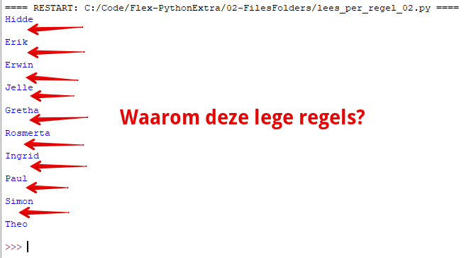
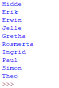

> Zorg dat je in de map van deze week blijft werken, zodat alles op 1 plek staat*

**We gaan Python gebruiken om mappen aan te maken voor een paar klasgenoten.**

> We gaan de namen regel voor regel uit een tekst bestand lezen en voor elke naam in het bestand een map aanmaken.

* Maak een nieuw tekstbestand met de naam: `klasgenoten.txt`
* Zet hier minimaal 10 voornamen van **jouw klasgenoten** in. Tip: gebruik Magister.
* Zet elke naam op een nieuwe regel (geen dubbele namen).

Bijvoorbeeld:

```text
Hidde
Erik
Erwin
Jelle
Gretha
Rosmerta
Ingrid
Paul
Simon
Theo
``` 
---

## Tekstbestand regel voor regel lezen
Je weet inmiddels dat je met `read()` *alle inhoud* van een geopend tekstbestand kan opvragen.
Maar we willen dit bestand **per regel** lezen.  

> Zo kun je voor elke naam straks een map maken!

---
Maak een nieuw Python bestand in IDLE: `lees_per_regel.py`.

Gebruik `readline()` om een tekstbestand per regel te lezen:

```python
# Bestand in read-only (r) mode openen (wel zo veilig, we gaan niets overschrijven)
bestand = open("klasgenoten.txt", "r")

# Een tekst naar het bestand schrijven
regel1 = bestand.readline()
print(regel1)

regel2 = bestand.readline()
print(regel2)

regel3 = bestand.readline()
print(regel3)

# Enzovoorts
```

Je snapt vast dat dit **ontzettend onhandig is* als je een bestand met 10000 regels hebt (of meer). Of als je niet weet hoeveel regels er in het bestand staan.

Eigenlijk wil je kunnen zeggen:   
> Geef me elke keer de volgende regel terug en stop als er geen regels meer zijn*

Dit kun je doen door een `while` loop te gebruiken. Verander je code in:

```python
# Bestand in read-only (r) mode openen (wel zo veilig, wegaan niets schrijven)
bestand = open("klasgenoten.txt", "r")

# Eerste regel inlezen en opslaan in de variabele: tekst_regel
tekst_regel = bestand.readline()

# while loop gaat door zolang er iets in de variabele tekst_regel staat
while tekst_regel:
    # Let op: laat de code in de while loop 4 spaties inspringen!

    # De regel op het scherm zetten:
    print(tekst_regel)

    # Volgende regel ophalen, zodat de while loop doorgaat
    tekst_regel = bestand.readline()
```

Als het goed is, zie je alle namen onder elkaar:

> Helaas staat er elke keer een lege regel tussen, hoe komt dat nou weer?



---

## Dubbele newlines weghalen  
Elke keer als je in een tekstfile naar een nieuwe regel gaat (op enter drukt) schrijf je een onzichtbaar karakter: **een newline**.

De dubbele regels krijg je omdat:

- De `readline()` functie de regel **met de onzichtbare newline erbij* leest! 
- De `print()` functie ook nog eens achter elke regel een **newline** zet.
- Daarom krijg je dus **dubbele newlines** lege regels

De code gaan we aanpassen. De onzichtbare **newline** die aan het einde van elke ingelezen regel staat gaan we verwijderen mert de `strip()` functie.

Net voor de `print()` van de `tekst_regel` haal je de **newline** er af met de `strip()` functie:

```python
# De newline er af halen
tekst_regel = tekst_regel.strip()

# De regel op het scherm zetten:
print(tekst_regel)
```

> Nu zijn de lege regels weg, stukken beter!



---

## Volgende stap
[Voor elke naam een map aanmaken met een tekstbestand er in](../05-folder-loop){:class="next"}


