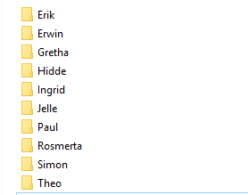

> Zorg dat je in de map van deze week blijft werken, zodat alles op 1 plek staat*

Kopieer alle code uit je bestand `lees_per_regel.py` en kopieer dit naar een nieuw Python bestand met de naam:  `maak_mappen.py`

> Voor elke klasgenoot in het bestand maak je nu een map aan met de naam van de klasgenoot.

Dit kun je als het goed is zelf door op de juiste plek de `os.mkdir()` functie te gebruiken met de juiste variabele.

Voor het script uit. Als je het goed hebt gedaan krijg je per naam een nieuwe map:

> Probeer dit zelf werkend te krijgen. Of vraag een klasgenoot om uitleg.

---

## Volgende stap
[Een bestand of map hernoemen of verwijderen](../06-rename-delete)

