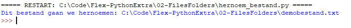
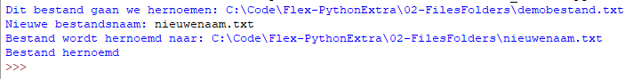
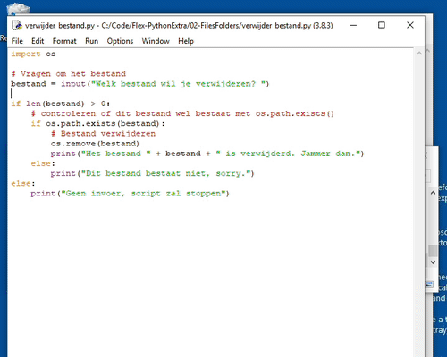

> Zorg dat je in de map van deze week blijft werken, zodat alles op 1 plek staat*

Je kunt nu tekstbestanden maken en ook tekst lezen en schrijven naar het bestand.

Nu nog een bestand hernoemen of verwijderen.

> **Wees hier wel voorzichtig mee, zodat je niet per ongeluk iets wist wat je nodig hebt!**

## Bestand maken en het absolute pad samenstellen

- Maak eerst een nieuw tekstbestand aan: `demobestand.txt`  
- Maak nu in IDLE een nieuw Python script aan en sla het op als: `hernoem_bestand.py`

Zet daar het volgende in:

```python
import os

# Bestandsnaam in variabele zetten
bestandsnaam = "demobestand.txt"

# Vraag de huidige map op en sla op in variabele: huidige_map
huidige_map = os.getcwd()

# met de os.path module kun je paden naar bestanden samenstellen
volledige_pad = os.path.join(huidige_map, bestandsnaam)
print("Dit bestand gaan we hernoemen: " + volledige_pad)
```

Je ziet dat nu het **absolute path** (pad) naar het bestand wordt getoond:



---

## Bestand hernoemen met input van de gebruiker

Nu gaan we de gebruiker vragen om een nieuwe bestandsnaam en het bestand hernoemen:

```python
# Om nieuwe naam vragen
nieuwe_naam = input("Nieuwe bestandsnaam: ")

if len(nieuwe_naam) > 0:
    # Map en nieuwe bestandsnaam gebruiken om volledige pad samen te stellen
    nieuwe_volledige_pad = os.path.join(huidige_map, nieuwe_naam)
    print("Bestand wordt hernoemd naar: " + volledige_nieuwe_pad)

    # Bestand hernoemen 
    os.rename(volledige_pad, nieuwe_volledige_pad)
    print("Bestand hernoemd")
else:
    print("Sorry, geen geldige invoer, einde programma")
```

Nu is het bestand als het goed is hernoemd:



> Vergeet niet de bestandsnaam weer terug te veranderen in `demobestand.txt` als je het script nog een keer uitvoert.

Uitdaging:

> Lukt het je om deze code met een `while` loop te verbeteren, zodat het bestand pas hernoemd wordt als de gebruiker ook echt iets heeft ingevuld?

---

## Bestand verwijderen

Om een bestand te verwijderen gebruik je de `os.remove()` functie.

- Maak een Python bestand: `verwijder_bestand.py` 
- Maak ook een leeg tekstbestand met de naam `verwijdermij.txt`
- Let goed op dat je overal het juiste aantal spaties (4) inspringt waar dat nodig is.

```python
import os

# Vragen om het bestand
bestand = input("Welk bestand wil je verwijderen? ")

if len(bestand) > 0:
    # controleren of dit bestand wel bestaat met os.path.exists()
    if os.path.exists(bestand):
        # Bestand verwijderen
        os.remove(bestand)
        print("Het bestand " + bestand + " is verwijderd. Jammer dan.")
    else:
        print("Dit bestand bestaat niet, sorry.")
else:
    print("Geen invoer, script zal stoppen")
```

Voer het script uit en typ de naam `verwijdermij.txt` om dat bestand te verwijderen.

**Let op: Dit verwijdert echt de bestanden, dus maak eerst lege test tekstbestanden aan die je mag verwijderen!** 

Nadat je de (juiste) bestandsnaam type, wordt het bestand direct verwijderd:



---

## Volgende stap
[Een lijst met alle bestanden en mappen opvragen en tonen](../07-listing){:class="next"}


