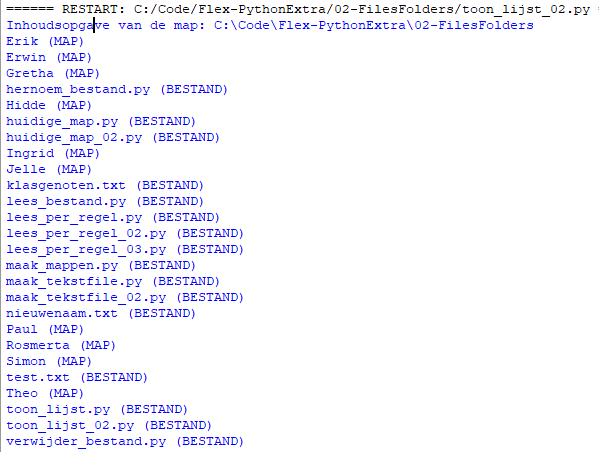

> Zorg dat je in de map van deze week blijft werken, zodat alles op 1 plek staat*

Flink wat stappen gedaan al. Als laatste ga je nog een lijst met ALLE bestanden die je nu hebt gemaakt op het scherm tonen.

Dit kun je doen met een loop en de `os.scandir()` functie.

- Maak een nieuwe Python bestand: `toon_lijst.py`

```python
import os

# Huidige map opslaan in variable: huidige_map
huidige_map = os.getcwd()

# De os.scandir() functie leest ALLE mappen en bestanden en zet ze in een list
# De list wordt hier opgeslagen in de variabele: alle_bestanden,
alle_bestanden = os.scandir(huidige_map)

# Met een for loop en print() kun je alles uit de list op het scherm zetten
print("Inhoudsopgave van de map: " + huidige_map)
for bestand in alle_bestanden:
    # Elke bestand is weer een apart soort waar je bijvoorbeeld de naam aan kan vragen
    print(bestand.name)

```

Dat is een flinke lap code en als het goed is, zie je je een lijst met alle bestanden op je scherm.

> Maak een screengrab vande uitvoer en sla deze op in je werkmap

---

## Het type bestand ook tonen

Om het *soort* bestand te tonen (bestand of folder) kun je een `if` statement gebruiken met de functies `is_file()` en `is_dir()`. Deze functie kun je aanroepen op de variabele `bestand` in de loop.

> Verander de `for` loop als volgt:

```python
for bestand in alle_bestanden:    
    if bestand.is_file():
        # Dit wordt uitgevoerd als dit een normale file is
        print(bestand.name + " (BESTAND)")
    elif bestand.is_dir():
        # Dit wordt uitgevoerd als dit een dir(ectory) is
        print(bestand.name + " (MAP)")
    else:
        # Dit wordt uitgeveord als het geen file en geen dir is
        print(bestand.name + " (ONBEKEND TYPE")
```

Nu wordt het soort bestand ook getoond:



---

## Klaar! Je werk op Github zetten
Zorg er voor dat je alles wat je hebt gemaakt commit en naar Github pusht zodat duidelijk is wat je hebt gedaan en hoe ver je bent gekomen. Hier lees je hoe je dat doet.
[Je werk *committen* en *pushen* naar Github](../../00-setup/commit_push.html)

---

> Vraag om hulp tijdens de Flex Python Extra lessen als je vastloopt!
