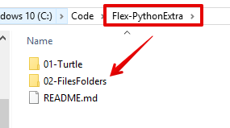

## Map maken voor deze les
* Maak eerste een nieuwe map aan **in je Flex-PythonExtra map**
* Noem de map: **02-FilesFolders**
* In deze map zet je al je code en bestanden die je in deze les maakt

> Je gaat leren hoe je het bestandssysteem kunt benaderen in je code.
Dit kan met de ingebouwde `os` en `io` modules van Python en door gebruik te maken van de `open()` function. 

Als het goed is, heb je na het doen van de opdrachten en oefeningen de volgende leerdoelen behaald en kun je dit later gebruiken bij het schrijven van code die gebruik maakt van bestanden en mappen.

### Leerdoelen
* Ik kan het pad naar de map opvragen waar mijn Python script wordt uitgevoerd.
* Ik kan de *werkmap* (working directory) veranderen naar andere map (directory) in Python.
* Ik kan de namen van alle bestanden en mappen opvragen en tonen die in opgegeven pad op mijn computer staan.
* Ik kan een tekst bestand openen in read-only (alleen-lezen) mode, met de open() functie.
* Ik kan een nieuw bestand maken, hernoemen en verwijderen met Python.
* Ik kan tekst naar een bestand schrijven. 
* Ik kan in een loop in 1x een gelaagde mappen structuur maken met code.

---

Met deze kennis kun je bijvoorbeeld:
- Lezen en schrijven van highscores naar een bestand.
- Nieuwe bestanden maken, kopiëren, hernoemen, verwijderen. 
- Geautomatiseerd een mappenstructuur maken met code.

### Aan de slag
[Huidige pad opvragen met de OS module](01-os-module)

