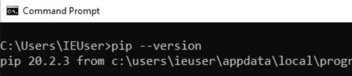
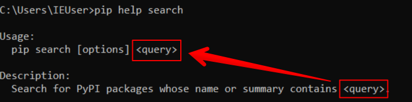

Om afbeeldingen te kunnen inlezen, bewerken en maken met Python hebben we de **Python Image Library** (Pillow) nodig.

Dit is een Python *package* (een soort Python plugin) die niet standaard in Python zit, maar die je kunt installeren met [pip](https://realpython.com/what-is-pip/){:target=_"blank"}. Pip is tegelijk met Python geïnstalleerd. 

> Een package is een verzameling losse modules. Een module is één Python file. De Pillow package bestaat dus uit meerdere modules (Python files) die samen de Pillow package vormen. 

Met het programma `pip` of `pip3` kun je Python (open-source) code van andere developers gebruiken, die dat online hebben gezet. Dat scheelt werk. Er is vaak al ergens op de wereld een developer die een package heeft gemaakt die jij net nodig hebt.

---

## Kijken of PIP werkt
Eerst kijken we of `pip` goed werkt en welke versie je hebt.

* Open een command-line venster (of Terminal op de Mac). 
* Op Windows: typ het volgende commando: `pip --version` 
* Op een Mac: vervang overal `pip` voor `pip3` als je een pip commando moet uitvoeren.

Als het goed is, zie je zoiets:



> Maak een screengrab en zet hem in je folder!

---

## De ingebouwde hulp van pip bekijken
**pip** heeft ingebouwde hulp, zodat je kunt zien wat je er mee kunt doen.
Voer nu pip uit met de `--help` optie:

```bash
pip --help
``` 

Je ziet nu een lijst met all (sub) commando's die je aan pip kunt geven. 
Die commando's geef je dus **NA** het `pip` commando.

---

## Zoeken naar een package
Zoals je ziet, is er ook een `pip search` (sub)commando. Maar hoe werkt dat (sub)commando? 
Je kunt voor elk (sub)commando een hulp tekst opvragen.

Dat doe je met: `pip help <subcommando>`

> Vraag de helptekst op voor het (sub)commando `search`:

```bash
pip help search
```

> De documentatie van software is technisch beschreven, dus je moet **GOED LEZEN!**. Dat is de enige manier om te snappen hoe je (bijvoorbeeld) *pip* kunt gebruiken.



Hier staat (vertaald naar het Nederlands) dat het `pip search` commando "Zoekt naar PyPI packages waarvan de naam of samenvatting `<query>` bevat".
De pijl geeft aan waar in het `pip` commando de `<query>` moet komen. 

Het commando wat je moet gaan uitvoeren om naar de *Pillow* package te zoeken is dus... (weet je het?)

---
## Zoeken naar de Pillow package
Je zoekt naar de *Pillow* package door `pip` zo uit te voeren: 

```bash
pip search Pillow
```

Als het goed is krijg je meerdere resultaten terug. Dit komt, omdat veel packages weer gebruik maken van Pillow.
Scroll een stukje naar boven en kijk of je de *Pillow* package waar we naar op zoek zijn kan vinden:


---

## Pillow proberen zelf te installeren
Zoals je in de hulp van *pip* mogelijk al zag, is er ook een *install* sub(commando)
Probeer eerst zelf de hulp voor het *install* (sub)commando op te vragen, en kijk of het je lukt om de *Pillow* package nu te installeren.

> Probeer het eerst zelf te installeren en ga daarna pas naar de volgende stap!

## Volgende stap
[Pillow inladen in je script](../02-pillow-start)

