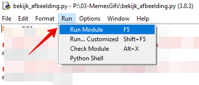
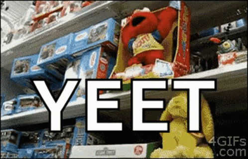

Gefeliciteerd, Pillow is geïnstalleerd. Nu kun je Pillow gebruiken door deze package te importeren.

We gaan een paar korte code oefeningen doen om te kijken of Pillow goed wordt ingeladen en werkt.

## Pillow modules

Pillow bestaat uit allerlei losse *modules*. Elke module kan iets speciaals met afbeeldingen of biedt speciale functionaliteit.
In Python zelf wordt de naam **PIL** gebruikt voor dit package.

* Met de **PIL.Image** module kun je afbeeldingen lezen en schrijven en simpele bewerkingen doen (schalen, croppen, metadata opvragen)
* Met de **PIL.ImageGrab** module is er om foto's te maken van je scherm.
* Met de **PIL.ImageDraw** module kun je simpele 2D vormen tekenen op een afbeelding (lijnen, cirkels)
* Met de **PIL.ImageFont** module kun je een lettertype inladen en daarna gebruiken om teksten op een afbeelding te zetten
* ... en zo heb je er nog veel meer. [Hier kun je zien welke dat zijn](https://pillow.readthedocs.io/en/stable/reference/index.html){:target="_blank"}

## Een afbeelding laden met Pillow
Je gaat de `PIL.Image` module inladen om een afbeelding te tonen.

* Open IDLE (of een simpele tekst editor zoals kladblok) en maak een Python file in je map: `bekijk_afbeelding.py`
* Importeer de Image module van Pillow: `from PIL import Image`  (zo importeer je alleen de `Image` module en niet alles) 
* Zet een eigen PNG, JPG of GIF afbeelding in je map, **bij je Python file**. Zorg dat het een kleurenafbeelding is. 
* Bij mij heet het bestand `sunset.jpg`
* Kopieer de naam van het bestand
* Laad nu het bestand in met: `afbeelding = Image.open("sunset.jpg")` - **Gebruik dus wel jouw bestandsnaam!**
* De afbeelding is ingeladen en is opgeslagen in de variabele: `afbeelding`
* Die variabele gebruik je nu om iets met de afbeelding te doen.

Verander het script als volgt.

```python
from PIL import Image

# Afbeelding openen en oplsaan in de variabele met de naam: afbeelding
afbeelding = Image.open("sunset.jpg")

# De afbeelding tonen in de standaard image viewer van jouw systeem
afbeelding.show()

# De breedte en hoogte van de afbeelding lezen en tonen 
breedte = afbeelding.width
hoogte = afbeelding.height

# Afmetingen op het scherm zetten
# Met str() zet je een int (getal) naar een string om. Dan kan print() het gebruiken.
print("De afbeelding is " + str(breedte) + " pixels breed en " + str(hoogte) + " pixels hoog")

# Andere info uitlezen en tonen
print(afbeelding.format, afbeelding.size, afbeelding.mode)
```

> Voer het Python script elke keer uit met F5 of via de menu optie Run > Module van IDLE



---

> Wat heeft jouw script als uitvoer? maak een screengrab van de uitvoer van het script. Hoeveel pixels breed en hoog is jouw afbeelding? 

Meer weten over wat je allemaal kunt doen met de `Image` module van Pillow? [Kijk of je met de documentatie en voorbeelden](https://pillow.readthedocs.io/en/stable/reference/Image.html#examples){:target="_blank"} een stukje code kunt schrijven een bewerking doet op de afbeelding.

---

## De afbeelding verkleinen: berekenen nieuwe afmetingen
Je gaat nu de afbeelding de helft kleiner maken. Daarna sla je de afbeelding op onder een nieuwe naam. 

* Maak een kopie van je `bekijk_afbeelding.py` script en noem het bestand: `bewerk_afbeelding.py`
* Open dit bestand in IDLE
* Haal alle `print` regels weg, maar houdt de `hoog` en `breed` variabelen in je script.

De afbeelding moet de helft kleiner worden. Maak twee nieuwe variabelen `helft_breedte` en `helf_hoogte`.
Bedenk eerst even hoe je de helft van de variabele `breed` en de helft van de variabele `hoog` daarin kunt opslaan.

> Gebruik hiervoor de `/` operator. Nog beter is de `//` operator die er een heel getal van maakt. Wel zo handig als je in pixels rekent. Want halve pixel bestaan niet. 

Het script wordt dan als volgt:

```python
from PIL import Image

# Afbeelding openen en opslaan in de variabele met de naam: afbeelding
afbeelding = Image.open("sunset.jpg")

# De afbeelding tonen in de standaard image viewer van jouw systeem
afbeelding.show()

# De breedte en hoogte van de afbeelding lezen en tonen 
# Met str() zet je een getal naar een string om. Dan kan print() het gebruiken.
breedte = str(afbeelding.width)
hoogte = str(afbeelding.height)

# breedte en hoogte door twee delen (en afronden naar beneden)

helft_breedte = afbeelding.width // 2
helft_hoogte = afbeelding.height // 2
```
---

## De afbeelding verkleinen en opslaan
Nu de afbeelding schalen naar de nieuwe afmetingen: `helft_breedte` en `helft_hoogte`.
Dit kan met de `resize()` functie van de `Image` module. De variabele `afbeelding` is een `Image`, dus kun je het als volgt aanroepen in je code:

> Voeg dit onderaan je script toe

```python
# Met het resize commando kun je de afmetingen van afbeelding aanpassen
# Deze verwacht een Tuple variabele:
nieuwe_afmeting = (helft_breedte, helft_hoogte)

# Hier wordt de afbeelding kleiner gemaakt en opgeslagen in een nieuwe variabele!
kleinere_afbeelding = afbeelding.resize(nieuwe_afmeting)

# Nu de kleinere afbeelding opslaan me save(). Gebruik de originele bestandsnaam met ergens "klein" er in. 
kleinere_afbeelding.save('sunset_klein.jpg')

# Zet hier nu zelf de Python code onder om de kleinere afbeelding op het scherm te tonen
```

---

Genoeg geoefend. Je gaat in de volgende stap een achtergrond afbeelding met een tekst combineren en zo een eigen meme maken. **Yeet!**



---

## Volgende stap
[Je eigen Meme maken](../04-meme-start)

