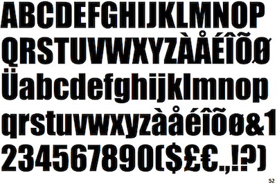
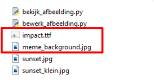

Tijd om je eigen meme te maken. Het doel is om zoiets te krijgen, dus een afbeelding met tekst er op.

---

## Achtergrond afbeelding van je meme zoeken
Gebruik [Google images](https://www.google.com/search?tbm=isch&q=meme+background){:target="_blank"} om een leuk achtergrond afbeelding voor je meme te zoeken, of [gebruik deze achtergrond afbeelding](meme_background.jpg){:target="_blank"}

> Zorg ervoor dat er nog geen tekst op staat! Sla de afbeelding op in je map met als bestandsnaam: `meme_background.jpg`.

> Is de afbeelding heel groot? Probeer de afbeelding te verkleinen naar maximaal 800 pixels breed.

## Het Impact lettertype downloaden 
Veel memes maken gebruik van het "Impact" lettertype. Deze ga je ook gebruiken. 

> Je mag natuurlijk ook een ander Truetype lettertype gebruiken, die moet je dan zelf in de map zetten en inladen.

* Download hier het Truetype lettertype bestand: [impact.ttf](impact.ttf)
* Zet het bestand bij je achtergrond afbeelding in de map 

> Je hebt in je map deze bestanden bij elkaar staan:

Nu kun je de meme gaan programmeren met Python (Yeet!)

---

## Volgende stap
[Tekst op de achtergrond zetten](../05-meme-compose)

