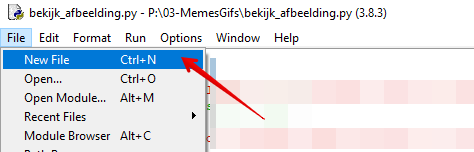
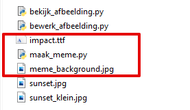
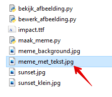
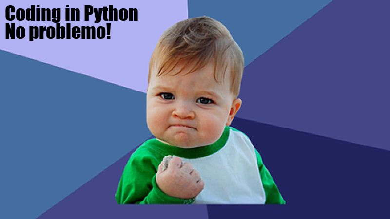

Je hebt nu alle bestanden om jouw meme te maken:

* Achtergrond afbeelding
* Lettertype

## Python script maken
* Maak in IDLE een nieuwe Python file met de naam: `maak_meme.py`. 
* Sla dit bestand op bij de achtergrond afbeelding en het lettertype.

 

Je hebt nu deze drie bestanden waar je mee werkt:



---

## De afbeelding laden met Python
Weet je nog hoe je een afbeelding moet inladen? Kijk in je vorige script en laadt de afbeelding in.

* Sla de ingeladen afbeelding op in de variabele: `achtergrond`.
* Lees de breedte en hoogte uit (zie vorige script).
* Sla deze gegevens op in de variabelen `breedte` en `hoogte`.
* Deze gegevens heb je nodig om straks de tekst op de juiste plek te zetten!

---

## Lettertype laden
De `ImageFont` module van Pillow heb je nodig om met lettertypes te werken. Deze moet je dus ook importeren in je script.

* Verander de regel `from PIL import Image` regel bovenin naar `from PIL import Image, ImageFont`.
* Zo laad je meerdere modules in één keer in.

Nu kun je het Truetype lettertype inladen:

```python
lettertype = ImageFont.truetype("<lettertype bestand>", <lettergrootte>)
```

* Voeg bovenstaande code toe aan je script. 
* Vervang `<lettertype bestand>` met de bestandsnaam van het lettertype.
* Vervang `<lettergrootte>` met de gewenste lettergrootte, bijvoorbeeld: 40

> Probeer het script uit te voeren. Als het goed is, krijg je nu geen foutmeldingen. Het klopt dat je nog niets ziet.

---

## Tekst schrijven op de afbeelding
Om iets te tekenen op een afbeelding hebben we als laatste nog de `ImageDraw` module nodig van Pillow.

> Met de kennis die je nu hebt, kun je de `ImageDraw` module nu inladen. Lukt dat je?

* Pas de `import` bovenin je script aan om ook de `ImageDraw` module in te laden.
* Let altijd goed op HOOFD en kleine letters. Dus NIET `imagedraw` maar `ImageDraw`
* Voer het script uit en kijk of er nog steeds **geen foutmeldingen** zijn.

> Bedenk nu korte om op de afbeelding te zetten.

Je maakt nu een onzichtbaar teken gebied aan over de afbeelding met deze code:

```python
# Vraag aan de ImageDraw module om een tekengebied te maken op de achtergrond afbeelding
tekengebied = ImageDraw.Draw(achtergrond)
``` 

Op dat tekengebied ga je schrijen met onderstaande code.

```python
# Tekst schrijven
tekst = "Coding in Python\nNo problemo!"
tekengebied.multiline_text((10,10), tekst, font=lettertype, fill=(0,0,0))

```
Korte uitleg:

* `tekst = "Coding in Python\nNo problemo!"` betekent: maak een variabele tekst en zet daar deze tekst in
* De `\n` die je ziet, is een newline, zo ga je naar een nieuwe regel. 
* `(10,10)` betekent: begin te tekenen op positie x=10 en y=10.
* `font=lettertype` betekent: gebruik het Impact lettertype wat in de variabele `lettertype` is geladen.
* `fill=(0,0,0)` betekent: gebruik RGB (red, green, blue) waarden 0,0,0. Dit is zwart.
* De tekst "Coding in Python\nNo problemo!" kun je veranderen naar je eigen tekst. 

Nu kijken wat er is gebeurd door de afbeelding te tonen:

```python
# Het resultaat tonen
achtergrond.show()

# En opslaan onder een andere naam
achtergrond.save("meme_met_tekst.jpg")
```

> De afbeelding staat als het goed is nu in je map

Zo ziet dat er bij mij uit:



En dit is de meme:



---

## Volgende stap
[Tekst positioneren](../06-meme-align-text)

