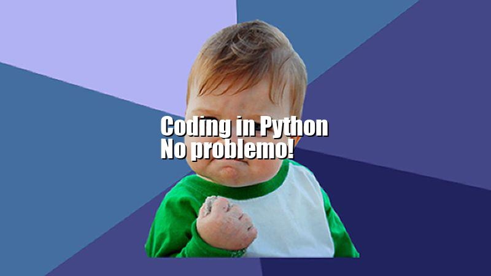

Het hele script tot nu toe ziet er als volgt uit:

```python
from PIL import Image, ImageFont, ImageDraw

# Laad de achtergrond afeebdling in de variabele: achtergrond
achtergrond = Image.open("meme_background.jpg")

# Afmetingen opslaan in eigen variabelen
breedte = achtergrond.width
hoogte = achtergrond.height

# Laad het Impact lettertype
lettertype = ImageFont.truetype("impact.ttf", 40)

# Vraag aan de ImageDraw module om een tekengebied te maken op de achtergrond afbeelding
tekengebied = ImageDraw.Draw(achtergrond)

# Tekst schrijven
tekst = "Coding in Python\nNo problemo!"
tekengebied.multiline_text((10,10), tekst, font=lettertype, fill=(0,0,0))

# Het resultaat tonen
achtergrond.show()

# En opslaan onder een andere naam
achtergrond.save("meme_met_tekst.jpg")

```

---

## De tekst in het midden zetten
Volgende uitdaging: de tekst in het midden van de afbeelding zetten. De tekst moet niet op positie 10,10 komen, maar in het midden.
Maar die `x` en `y` zijn afhankelijk van hoe groot de tekst EN hoe groot de afbeelding is!

> Wat heb je nodig om de tekst in het midden te zetten? Welke gegevens weet je al?

Kijk naar de volgende afbeelding. wat zou de formule zijn om de juiste `x` en `y` voor de tekst te berekenen?


De juiste berekening is deze:

> Let op: Dit is geen Python, dus niet in je script zetten nog!

```
x van de tekst = (breedte - breedte_tekst) / 2
y van de tekst = (hoogte - hoogte_tekst) / 2
```

> Je moeten hiervoor **de afmetingen van de tekst weten!**. Die ga je nu opvragen met Pillow.

---

## De afmeting van een tekst opvragen
De `ImageDraw` module heeft een functie `textsize()`. Hiermee kun je de afmeting van een tekst opvragen.

> Als je die gegevens hebt, kun je de tekst centreren op de achtergrond met de berekening die hierboven staat!

* **LET OP**: Deze berekeningen moeten in de code **voor** het schrijven van de tekst komen
* Zet de code direct NA `tekst="...."`.
* Laat de andere code er onder gewoon staan, die blijft werken.


```python
# Bereken de breedte en hoogte van de tekst
tekst_breedte, tekst_hoogte = tekengebied.textsize(tekst, font=lettertype) 
print("tekstbreedte=" + str(tekst_breedte) + ", tekst_hoogte=" + str(tekst_hoogte))
``` 

> Voer het script uit en kijk of je de afmetingen van de tekst te zien krijgt in het output venster van Python.

Dit zou je moeten zien (met andere getallen als je afbeelding ander formaat is)


---

## De formule gebruiken om de tekst te plaatsen
Je hebt nu twee nieuwe variabelen er bij: `tekst_breedte` en `tekst_hoogte` met de afmetingen van de tekst.

> Nu kun je de berekening omzetten in Python code en in plaats van `10,10` de juiste `tekst_x` en `tekst_y` gebruiken.

Voeg na de vorige code dit toe:

```python
# Tekst positie berekenen
tekst_x = (breedte - tekst_breedte) / 2
tekst_y = (hoogte - tekst_hoogte) / 2  
```

En verander dan in de regel waar je de tekst schrijft, de `10,10` met  `tekst_x, tekst_y`.

```python
# De nieuw berekende tekst_x en tekst_y gebruiken
tekengebied.multiline_text((tekst_x, tekst_y), tekst, font=lettertype, fill=(0,0,0))
```

> Voer het script uit. Staat de tekst nu in het midden?

---

## Als laatste tekstschaduw toevoegen
De meeste memes hebben een witte tekst met een kleine donkere schaduw, en niet een zwarte tekst zoals nu.

> Hoe zou je een witte tekst met een donkere tekst er achter kunnen maken? 

De truc is om gewoon **nog een keer dezelfde tekst op de afbeelding te schrijven**, maar dan in het wit.
De witte tekst zet je dan een paar pixels naar links en naar boven.

Zet onder de regel waar je de tekst op de afbeelding zet de volgende code:

```python
tekengebied.multiline_text((tekst_x-2, tekst_y-2), tekst, font=lettertype, fill=(255,255,255))
``` 

* `tekst_x-2` betekent: dezelfde x als de zwart tekst, maar dan 2 pixels naar links
* `tekst_y-2` betekent: dezelfde y als de zwart tekst, maar dan 2 pixels naar boven
* `fill=(225,255,255)` betekent: Waarde van R=255 (red), G=255 (green), B=255 (blue). elke kleur staat volledig aan. Dan krijg je de kleur wit. 

Voer het script uit en je ziet dat het nu een echte meme is geworden.



> Bij mij helaas precies over het hoofd van de jongen. Dus experimenteer met de juiste positie van de tekst

---

## Bonus: Memes genereren uit een tekst bestand

> Een leuke puzzel om zelf mee aan de slag te gaan (kijk hoe ver je komt).

Met de kennis die je nu hebt uit [de eerdere les(stof) over bestanden](../../02-filesystem-io){:target="_blank"}.  
Lukt het je om wat hieronder staat te maken in Python?

* Een tekst bestand te maken met per regel een tekst.
* Dit tekst bestand regel voor regel te lezen.
* Voor elke regel tekst, de tekst op de achtergrond afbeelding te zetten.
* En dus, voor elke regel een apart Meme plaatje te maken 
* ... en deze op te slaan onder een eigen bestandsnaam?

> In een volgende les zal ik laten zien hoe je dit kunt doen.

---

## Klaar! Je werk op Github zetten

Zorg er voor dat je alles wat je hebt gemaakt commit en naar Github pusht, zodat duidelijk is wat je hebt gedaan en hoe ver je bent gekomen. Hier lees je hoe je dat doet.

[Je werk *committen* en *pushen* naar Github](../../00-setup/commit_push.html){:class="next"}

> Dit was wel een flinke opdracht en best ingewikkeld. Dus neem je tijd om er aan te werken.
 
> Belangrijkste is dat je echt de tijd neemt om alle stappen te doen. Het hoeft niet meteen af, maar liefst wel binnen twee weken.

> Vraag om hulp tijdens de Flex Python Extra lessen als je vastloopt! 


