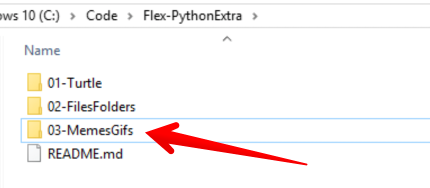

## Map maken voor deze les
* Maak eerste een nieuwe map aan **in je Flex-PythonExtra map**
* Noem de map: **03-MemesGifs**
* In deze map zet je alle bestanden en code die je in deze les maakt.

### Leerdoelen van deze les
* Ik kan de Pillow module (Python Imaging Library) installeren met `pip` de *package manager* van Python.
* Ik kan de Pillow module importeren in een eigen Python script.
* Ik kan een ingeladen afbeelding tonen in de standaard image viewer van je systeem.
* Ik kan een JPG, PNG of GIF openen, vergroten of verkleinen en opslaan onder een andere naam.
* Ik kan een tekst op een achtergrond afbeelding plaatsen en deze nieuwe meme afbeelding apart opslaan.

### Hulplijnen en documentatie
Wil je eerst kijken wat je allemaal kunt doen met Pillow? Lees dan de documentatie eens door:
[Pillow Documentatie](https://pillow.readthedocs.io/en/stable/handbook/tutorial.html)

---

## Volgende stap
[Beginnen met Pillow](01-install-pillow)

