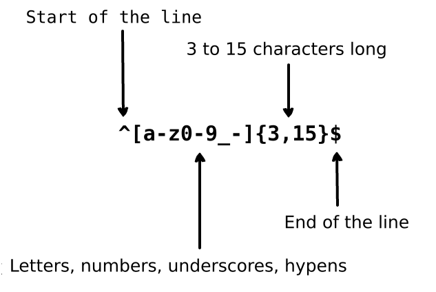
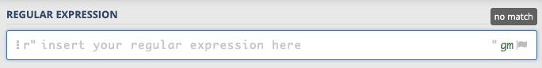
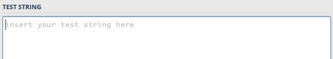
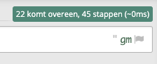
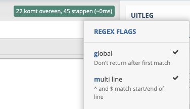

Regular expressions gebruik je om naar bepaalde patronen te zoeken in een tekst.
De *regular expression* schrijf je op een speciale manier, **er zijn speciale regels en tekens nodig bij het opstellen van de regular expression**.  

Door gebruik te maken van deze speciale tekens en de betekenis er van te begrijpen, kun je een patroon opgeven dat je wilt zoeken binnen een tekst.

Om gebruik te maken van een regular expression heb je twee dingen nodig:
- Het patroon (de *regular expression*) waar je naar wilt zoeken.
- De tekst waarin je het patroon wilt "matchen" of vinden. 

Hier zie je een voorbeeld hoe een regular expression er uit kan zien. Maak je nog niet druk over wat dit allemaal betekent.

---

## Regular expressions uitproberen
Voordat je in Python code gaat schrijven, ga je eerst oefenen met de basis regels van *regular expressions*.

Open een nieuw browser venster of tab met deze website: [https://regex101.com/](https://regex101.com/){:target="_blank"}

> Op deze website kun je regular expressions uitproberen.

- Zet de taal op Python
- Bij Instellingen kun je de taal op Dutch zetten, als je dat prettiger vindt.

**Op de volgende pagina's staan elke keer regualr expressions en test strings, die ga je als volgt invoeren en testen:**

In het invoerveld *regular expression* voer je de regular expression in:

In het invoerveld *test string* voer je de tekst in waarin je wilt zoeken naar de regular expression (het patroon): 

Zet bij de "REGEX FLAGS" deze opties aanL: global en multiline:

- De "g" flag zorgt er voor dat de matching van het patroon doorgaat tot einde van de tekst
- De "m" flag zorgt er voor dat de matching ook voor meer regels (multiline) tekst geldt.

---

## Volgende stap
In de volgende pagina's staan de voorbeelden waarmee je gaat oefenen.  
[Oefenen met losse letters](practice_01){:class="next"}

