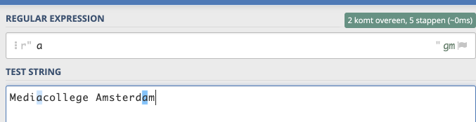

Een *regular expression* schrijf je op een speciale manier. **Er zijn speciale regels en tekens nodig**.  
Door gebruik te maken van deze speciale tekens kun je een patroon opgeven dat je wilt zoeken binnen een tekst.

Om gebruik te maken van een regular expression heb je twee dingen nodig:
- Het patroon (de *regular expression*) waar je naar wilt zoeken.
- De tekst waarin je het patroon wilt "matchen" of vinden. 

---

## Regular expressions uitproberen
Voordat je in Python code gaat schrijven, ga je eerst oefenen met wat basis regels van *regular expressions*.

Open een nieuw browser venster of tab met deze website: [https://regex101.com/](https://regex101.com/){:target="_blank"}
Op deze website kun je regular expressions uitproberen.

- Zet de taal op Python
- Bij Instellingen kun je de taal op Dutch zetten, als je dat prettiger vindt.

**Voor elk voorbeeld hieronder doe je het volgende:** 

In het invoerveld *regular expression* voer je de regular expression in:

In het invoerveld *test string* voer je de tekst in waarin je wilt zoeken: 

---

## Voorbeelden van regular expressions

> Voer dus de regular expression en de tekst in op de regex101.com website en kijk wat er gematcht wordt!

> Maak van elk voorbeeld een screengrab en sla hem op in je folder als bewijs!

In de onderstaande tabellen staat aan de linkerkant elke keer de *regular expression* en aan de rechterkant de *test string* waarin gezocht wordt.

---

## Zoeken naar losse letters in een tekst
De meest simpele regular expression. Deze matcht de letter in de test string.
Dit is hoofdletter gevoelig!, dus `M` is iets anders dan `m`.

**Voorbeeld**
Zo voer je onderstaande regular expressions en test string dus in. Je ziet hier dat hier de "a" blauw wordt.
Dit zijn de "matches" van de regular expression.
  

> Probeer het nu zelf:

| Regular expression  | Test string               | Matches                                            |
| ------------------- | ------------------------- | -------------------------------------------------- |
| a                   | Mediacollege Amsterdam    | Medi**a**college Amsterd**a**m                     |
| m                   | Mediacollege Amsterdam    | Mediacollege A**m**sterda**m**                     |
| M                   | Mediacollege Amsterdam    | **M**ediacollege Amsterdam                         |
| .                   | Mediacollege Amsterdam    | **Mediacollege Amsterdam**                         |

> Een punt: `.` matcht een willekeurig karakter

#### Oefening 1
Gebruik de regex101.com website.

- Match de letter `o` in de test string `Boerenkool` (en maak een screengrab!)
- Match de letter `c` in de test string `Chocolade` (en maak een screengrab!)
- Maak screenshots en bewaar ze in je map

---

## Zoeken naar meerdere letters in een tekst
Wil je alleen een paar letters matchen, zonder dat ze in een bepaalde volgorde staan dan gebruik je de *range* operator: `[<letters>]`.

Zoeken naar de *a* en de *m* doe je dan met deze regular expression: `[am]`. 

| Regular expression  | Test string               | Matches                                            |
| ------------------- | ------------------------- | -------------------------------------------------- |
| [am]                | Mediacollege Amsterdam    | Medi**a**college A**m**sterd**a****m**             |
| [eA]                | Mediacollege Amsterdam    | M**e**diacoll**e**g**e** **A**mst**e**rdam         |   

#### Oefening 2  
Gebruik de regex101.com website.

- Match de letters `y` en `t`, `Python is my first language, yeet!`.
- Match de letters `X` en `x` in de test string `Xerox`.
- Maak screenshots en bewaar ze in je map

---

## Zoeken naar letters in juiste volgorde (woorden)
Geef je meerdere letters op, maar NIET binnen de `[]` dan moeten ze in die volgorde staan. 

| Regular expression  | Test string               | Matches                                            |
| ------------------- | ------------------------- | -------------------------------------------------- |
| dam                 | Mediacollege Amsterdam    | Mediacollege Amster**dam**                         |
| col                 | Mediacollege Amsterdam    | Media**col**lege Amsterdam                         |

---

## Alle letters in een bepaalde reeks matchen

Soms wil je bijvoorbeeld alle letters van a tot z (het hele alfabet) matchen, of alle cijfers van 0-9.
Je wilt als regular expression een bepaalde reeks of range karakters opgeven.

Dit kan door tussen de `[]` een reeks op te geven. 

**Bijvoorbeeld**

* `[a-z]` = Match alle **kleine** letters a tot z.
* `[A-Z]` = Match alle **hoofdletters** a tot z.
* `[a-zA-Z]` = Match **alle** letters van a tot z (hoofd- en kleine letters).
* `[0-9]` = Match de cijfers 0 tot en met 9.

> Probeer dit nu zelf uit op de regex101.com website:

| Regular expression  | Test string                | Matches                                              |
| ------------------- | ---------------------------- | -------------------------------------------------- |
| [a-z]               | Mediacollege Amsterdam 2020  | M**ediacollege** A**msterdam** 2020                |
| [a-zA-Z]            | Mediacollege Amsterdam 2020  | **Mediacollege** **Amsterdam** 2020                |
| [a-zA-Z0-9]         | Mediacollege Amsterdam 2020  | **Mediacollege** **Amsterdam** **2020**            |

---

In de volgende stap ga je nog een aantal extra *operators* oefenen. Daarna gaan we dit in Python code gebruiken.

## Volgende stap
[Verder oefenen met operators](../02-regex-operators)

