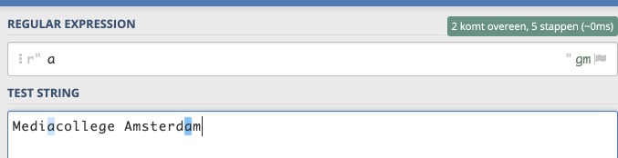

Oké, Je gaat nu de basis regels van regular expressions oefenen. Je gebruikt hiervoor dus de [regex101.com](https://regex101.com){:target="_blank"} website.

Voor elk voorbeeld hieronder doe je het volgende :

> Voer de regular expression en de test string in op de regex101.com website en kijk wat er gematcht wordt! De matches krijgen een kleur

> Maak van elk voorbeeld een screengrab en sla hem op in je folder als bewijs!

In de onderstaande tabellen staat aan de linkerkant elke keer de *regular expression* en aan de rechterkant de *test string* waarin gezocht wordt.

---

## Zoeken naar losse letters in een tekst
Dit is de eenvoudigste regular expression. Deze matcht de opgegeven letter in de test string.
Let op: dit is hoofdletter gevoelig!, dus `M` is iets anders dan `m`.

#### Voorbeeld invoer
Zo voer je onderstaande regular expressions en test string dus in. Je ziet hier dat de letters "a" blauw wordt.
De letters "a" worden dus gematcht door deze regular expression!
  

> Probeer het nu zelf:

| Regular expression  | Test string               | Matches                                            |
| ------------------- | ------------------------- | -------------------------------------------------- |
| a                   | Mediacollege Amsterdam    | Medi**a**college Amsterd**a**m                     |
| m                   | Mediacollege Amsterdam    | Mediacollege A**m**sterda**m**                     |
| M                   | Mediacollege Amsterdam    | **M**ediacollege Amsterdam                         |
| .                   | Mediacollege Amsterdam    | **Mediacollege Amsterdam**                         |

> Een punt: `.` matcht een willekeurig karakter

---

### Zelf proberen

Gebruik de regex101.com website. **Maak screenshots en bewaar ze in je map!**

- Match de letter `o` in de test string `Boerenkool` (en maak een screengrab!)
- Match de letter `c` in de test string `Chocolade` (en maak een screengrab!)

---

## Volgende stap
[Oefenen met meerdere letters](practice_02){:class="next"}
