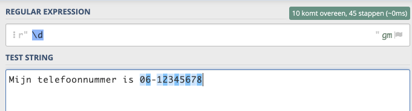
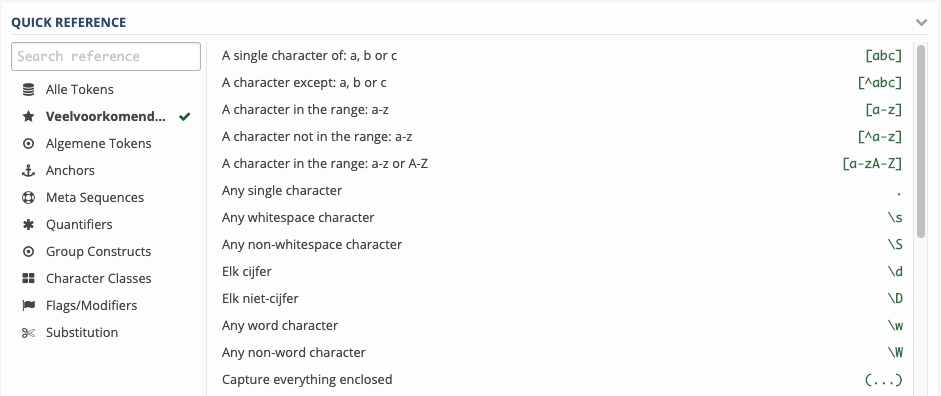
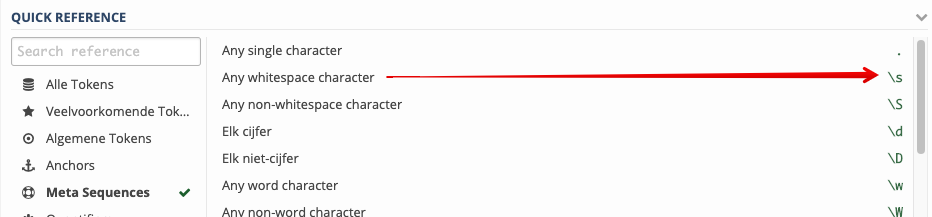
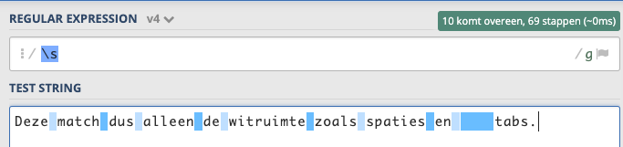

Je gaat nog even verder oefenen met een paar andere operators die je veel gebruikt in regular expressions. Daarna ga je deze kennis toepassen in Python code.

---

## Een letter of patroon wel of niet toestaan, en hoe vaak?
Het is handig om aan te kunnen geven of een karakter of reeks karakters **mag** of juist **moet** voorkomen om een bepaalde plek in de tekst.
Dit die je met de meta karakters: `+`, `*`, `?` en `|`

Hiermee geef je aan of, en hoe vaak het patroon of de letter(s) die er **VOOR* staan mogen voorkomen:

* `*` = Mag 0 of meer keer voorkomen.
* `+` = Mag minimaal 1 keer voorkomen.
* `?` = Mag 0 of maximaal 1 keer voorkomen.
* `|` = Wat links OF wat rechts van de `|` staat mag voorkomen.

| Regular expression  | Test string                | Matches                                                     |
| ------------------- | -------------------------- | ------------------------------------------------------------|
| a*                  | Banaan                     | B**a**n**aa**n                                              |
| ma+n                | man                        | **man**                                                     |
| ma+n                | mn                         | **Geen match**. De "a" moet minimaal 1x voorkomen na de "m" |
| ma?n                | mn                         | **mn**  (want de a mag 0x of 1x voorkomen)                  |
| ma?n                | man                        | **man** (want de a mag 0x of 1x voorkomen)                  |
| r\|s                 | mars                       | ma**rs** (want de r OF s)                                   |

---

## Juist NIET bepaalde letters matchen
Wil je juist NIET de karakters matchen die tussen de `[` en `]` staan, dan kun je de `^` gebruiken aan het begin.
Je keert dan de betekenis om: match NIET deze karakters.

> In het eerste voorbeeld worden dus NIET de karakters **abcde** gematcht, en dus WEL de andere karakters: **fg**.

Probeer deze voorbeelden weer uit op de regex101.com website en maak screengrabs van het resultaat.

| Regular expression        | Test string                    | Matches                              |
| ------------------------- | ------------------------------ | ----------------------------------   |
| [^abcde]                  | abcdefg                        | abcde**fg**                          |
| [^a-z]                    | a1b2c3d4e5                     | a**1**b**2**c**3**d**4**e**5**       |

---

## Cijfers matchen
In de vorige stap heb je gezien hoe je met `[0-9]` alle cijfers kunt vinden. 

Dit kan met een kortere regular expression, namelijk `\d`  (denk aan de `d` van *digit* )

Wil je juist alles **behalve** cijfers vinden, dan gebruik je `\D` (met hoofdletter D)  

| Regular expression  | Test string                    | Matches                                   |
| ------------------- | ------------------------------ | ----------------------------------------- |
| \d                  | Mediacollege Amsterdam 2020    | Mediacollege Amsterdam **2020**           |
| \D                  | Mediacollege Amsterdam 2020    | **Mediacollege Amsterdam&lt;s&gt;**2020   |

> Let op, ook de spaties worden dus gematcht, ook al zie je ze niet. Daarom hier aangegeven met &lt;s&gt;.

#### Voorbeeld met \d

---

## Zoeken naar alfanumerieke karakters
Ook de regular expression `[a-zA-Z0-9]` kun je veel korter schrijven, namelijk `\w`. 

Dit matcht alle alfanumerieke karakters inclusief de `_` (underscore).

Wil je juist alles **behalve** de alfanumerieke karakters matchen, dan gebruik je `\W` (met hoofdletter W)

| Regular expression  | Test string                      | Matches                                        |
| ------------------- | -------------------------------- | ---------------------------------------------- |
| \w                  | Mediacollege##2020!!!            | **Mediacollege**##**2020**!!!                  |
| \W                  | Mediacollege##2020!!!            |  Mediacollege**##**2020**!!!**                 |   

---

## Zoeken aan het begin of eind
Wil je dat het patroon aan aan het begin of einde MOET staan dan gebruik je de `^` en de `$`.
De `^` bepaalt dat een tekst aan het begin MOET staan, de `$` juist dat deze aan het einde MOET staan.  

| Regular expression  | Test string                | Matches                                            |
| ------------------- | -------------------------- | -------------------------------------------------- |
| ^Media              | Mediacollege Mediatheek    | **Media**college Mediatheek                        |
| dam$                | Rotterdam Amsterdam        | Rotterdam Amster**dam**                            |
| dam$                | Amsterdams                 | Amsterdams                                         |

---

> De laatste regular expression in de tabel hierboven matcht NIETS. Want `dam` staat niet helemaal aan het einde van de tekst!

## Probeer wat regular expressions uit
Op de website regex101.com zie je rechtsonder nog veel meer van dit soort patronen die je kunt gebruiken.

* Gebruik een eigen bedachte tekst
* Probeer minstens drie van die operators/tokens uit
* Maak weer screengrabs van het resultaat

Wat elke operator (of token) doet staat er naast.

> Maak screengrabs van de invoer en uitvoer 

Voorbeeld met `\s`. Deze matcht *"Any whitespace character"*, dus alle witruimte in een tekst. 

Resultaat:

----

## Volgende stap

> Zo, dat was flink wat informatie. Nu ga je er echt wat mee programmeren in Python.

[Regular expressions gebruiken in Python](../03-regex-python-01){:class="next"}

