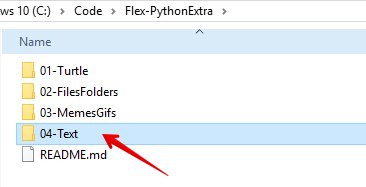

## Map maken voor deze les
* Maak eerste een nieuwe map aan **in je Flex-PythonExtra map**
* Noem de map: **04-Text**
* In deze map zet je alle bestanden en code die je in deze les maakt.

---

### Regular expressions? Wat zijn dat?
Met *regular expressions* kun je patronen vinden binnen een tekst.  
Met een *regular expression* kun je aangeven:
- Naar welk patroon je zoekt
- Op welke plek in de tekst dat patroon mag of moet staan.
- Hoe vaak een patroon wel of niet mag voorkomen in de tekst.
- In welke volgorde de letters/cijfers van het patroon moeten of mogen staan
- ... en nog meer

> Regular Expressions worden in bijna alle programmeertalen ondersteund.

---

### Wanneer gebruik je regular expressions?
Je kunt regular expressions voor veel verschillende toepassingen gebruiken:

- Denk aan search engines die zoeken naar de opgegeven zoekterm in een lange tekst.
- Het controleren of een postcode, telefoonnummer of e-mail adres correct is ingevoerd.
- Een wachtwoord controleren op sterkte en veiligheid.
- Scheldwoorden in een tekst of chat vervangen met bijvoorbeeld *%$!%@$$@!* of een &#128544;
- ... en nog veel meer.

> In deze flex les leer je de basis van regular expressions. 

Wil je er meer over weten en je er verder in verdiepen, kijk dan eens op deze websites:

- [Python docs: Regular expressions](https://docs.python.org/3/library/re.html?highlight=re){:target="blank"} (erg technisch)
- [Programiz: Regular Expressions](https://www.programiz.com/python-programming/regex){:target="blank"}
- [Real Python: Regular Expressions](https://realpython.com/regex-python/){:target="blank"}
- [Medium: Regular expressions cheatsheet](https://medium.com/factory-mind/regex-tutorial-a-simple-cheatsheet-by-examples-649dc1c3f285){:target="blank"}

---

### Leerdoelen 
- Ik kan de speciale regular expression operators `^`, `$`, `+`, `*`, `|` en `?` gebruik om een patroon in een tekst te vinden.
- Ik kan de basis meta karakters van regular expressions toepassen om een patroon te vinden dat gematcht moet worden.
- Ik kan de *re* (regular expression) module van Python importeren in mijn script
- Ik kan controleren of de input() van een gebruiker voldoet aan een bepaald patroon (postcode, telefoonnummer)
- Ik kan alle email adressen uit een tekstbestand halen en op het scherm tonen met een regular expression. 

---

## Opdrachten / uitdagingen

[Starten met regular expressions](01-start-regex/){:class="next"}

