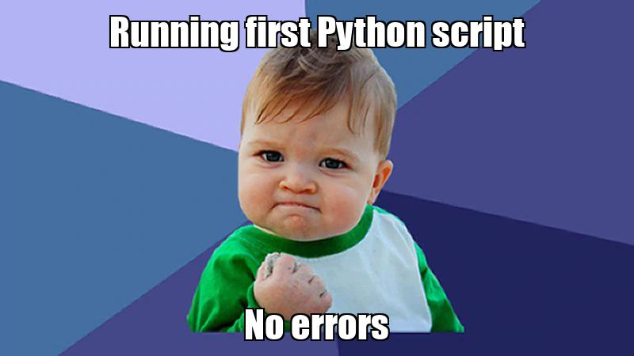

# Flex: Python Extra

---

> De Python Extra (FLEX) lessen zijn bedoeld om je verder te verdiepen in het programmeren in de Python programmeertaal. De lessen zijn een extra aanvulling op Python lessen die je krijgt deze periode.

---

### Onderwerpen

Overzicht van onderwerpen Python Extra (voorlopig)

1. [Tekenen en animeren in Python met Turtle](01-turtle-graphics/index.md)
2. Lezen en schrijven van bestanden en mappen / Bestandssysteem
3. Je eigen animated GIF’s en Meme’s maken met Pillow
4. Tekstmanipulatie met reguliere expressies (wat zijn dat?)
5. Datum en tijd gebruiken in Python code
6. Beter worden met lists?
7. Een e-mail sturen met Python
8. Arcade game engine
9. Code van andere developers gebruiken
10. ... ?

---

### Wat heb je nodig?

In ieder geval heb je er zin in en vind je het leuk om zelf aan de slag te gaan met code. Nieuwsgierigheid en doorzettingsvermogen helpen hier bij.

Om aan de lessen mee te kunnen doen heb je een laptop/computer nodig met:

- Python 3
- IDLE (editor die bij Python zit)
- Git ingesteld 
- Github account

> **Bij de start van de eerste Python Extra les heb je dit al geinstalleerd en ingesteld.** 

Kom je er niet uit vraag dan hulp aan je buddy uit het 2e of 3e jaar of vraag een klasgenoot of de docent [Hidde Braun](sip:h.braun@ma-web.nl) via de chat functie van Microsoft Teams of per [e-mail](mailto:h.braun@ma-web.nl).

---

### Werkwijze en beoordeling

Om de module **Hello You** voldoende af te sluiten is actieve deelname en aanwezigheid vereist. Omdat deze lessen online worden gegeven is het van belang dat je op tijd aanwezig bent en actief meedoet en vragen stelt als je er niet uit komt.

> De opdrachten waar je in de Flex lessen aan werkt lever je aan het einde van elke les in via Github. 

**In de eerste les maak je deze Github repository aan en maak je daar de eerste opdracht in** (en later ook de andere opdrachten en oefeningen)

---
## Volgende stap

[Map en Github repository maken voor Python Extra](00-setup/index.md)

